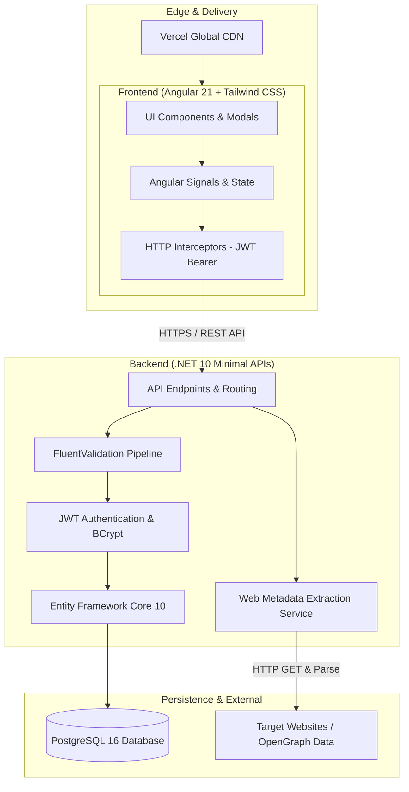
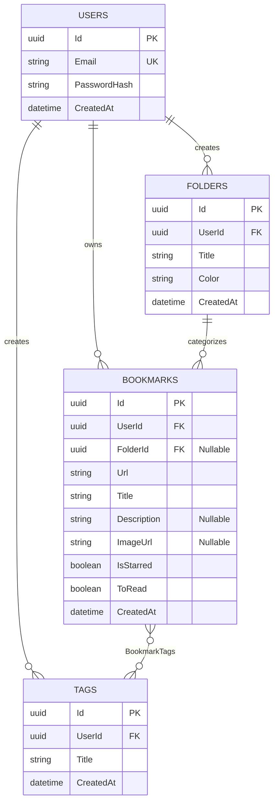

# 🔖 Bookmark Manager

<div align="center">


**A high-performance, full-stack bookmark management platform featuring automated web metadata extraction, custom folder hierarchies, flexible multi-tagging, reactive signal state, and a clean modern UI.**

[🌐 Live Demo](https://bookmark-manager-pink-eight.vercel.app) • [📖 Swagger API Docs](https://bookmark-manager-l5sb.onrender.com/swagger) • [⚡ Architecture](#-system-architecture) • [🚀 Getting Started](#-getting-started)

</div>

---

## 📌 Table of Contents

- [Overview](#-overview)
- [Key Features](#-key-features)
- [Live Links](#-live-links)
- [Tech Stack](#-tech-stack)
- [System Architecture](#-system-architecture)
- [Database Schema](#-database-schema)
- [REST API Reference](#-rest-api-reference)
- [Getting Started](#-getting-started)
  - [Prerequisites](#prerequisites)
  - [Option 1: Quickstart with Docker Compose](#option-1-quickstart-with-docker-compose-recommended)
  - [Option 2: Manual Local Setup](#option-2-manual-local-setup)
- [Deployment](#-deployment)
- [Engineering Highlights](#-engineering-highlights-for-technical-interviews)
- [Author & License](#-author--license)

---

## 🌟 Overview

**Bookmark Manager** is an enterprise-ready, personal bookmarking and reading-list application designed to replace bloated browser bookmark bars with a centralized, searchable, and intelligent workspace.

Users simply input a URL, and the platform automatically scrapes and extracts rich webpage metadata (OpenGraph preview images, page titles, descriptions, and domains). With instant search, custom colored folders, multi-tag taxonomies, and view customization (Grid vs. List), organizing research, articles, and favorite tools becomes seamless.

---

## ✨ Key Features

- **⚡ Automated Web Metadata Enrichment**:
  - Automatically fetches OpenGraph tags (`og:title`, `og:description`, `og:image`) and HTML meta tags upon URL submission.
  - Automatically formats and trims domain fallbacks if metadata is missing.
- **📁 Custom Folders with Color Coding**:
  - Organize bookmarks into discrete folders with customizable hex colors.
  - Track per-folder bookmark counts in real-time.
- **🏷️ Flexible Multi-Tag Taxonomy**:
  - Assign multiple tags to each bookmark for multi-dimensional filtering.
  - Quick-filter bookmarks by clicking tags directly on cards or in the sidebar.
- **⭐ Smart Sections**:
  - **All Bookmarks**: Global collection across all folders.
  - **Starred**: Quick access to pinned favorites.
  - **Read Later**: Dedicated queue for saved articles and reading lists.
- **🔍 Multi-Dimensional Reactive Search & Filtering**:
  - Instant client-side search across titles, URLs, and descriptions.
  - Compound filters: combine Section + Folder + Tag + Keyword search simultaneously.
- **📊 Global Reactive Counters**:
  - Sidebar counts remain global and reflect total counts even while searching or filtering within specific folders.
  - Real-time updates on add, edit, delete, star, or read-later toggle using Angular Signals.
- **🔐 Secure JWT Authentication**:
  - Complete registration, login, and token-verification lifecycle (`/api/auth/profile`).
  - Passwords hashed using **BCrypt** with unique salts.
  - Bearer token authentication with claims validation and automatic Angular HTTP interceptor injection.
- **🛡️ Resilient User Experience**:
  - Reusable, accessible confirmation modals with backdrop blur for destructive actions (delete bookmark/folder/tag).
  - Elegant skeleton loading states and responsive mobile sidebar drawer with escape-key and backdrop-click handlers.
  - View switcher (compact List view vs. detailed responsive Card Grid).

---

## 🔗 Live Links

| Component | URL | Notes |
| :--- | :--- | :--- |
| **Frontend Application** | [bookmark-manager-pink-eight.vercel.app](https://bookmark-manager-pink-eight.vercel.app) | Hosted on **Vercel** with global edge CDN |
| **Backend API (Swagger)** | [bookmark-manager-l5sb.onrender.com/swagger](https://bookmark-manager-l5sb.onrender.com/swagger) | Hosted on **Render** (Docker containerized) |
| **Database** | Neon Serverless PostgreSQL | Hosted on **Neon AWS (us-east-2)** |

> *Note: On free cloud tiers, the backend may take ~30–45 seconds to spin up on the first request if sleeping (cold start).*

---

## 🛠️ Tech Stack

### Frontend
- **Framework**: [Angular 21](https://angular.dev/) (Standalone Components, Signals, Signal Inputs/Outputs, `@if` / `@for` control flow)
- **Language**: [TypeScript 5.9](https://www.typescriptlang.org/)
- **Styling**: [Tailwind CSS v4](https://tailwindcss.com/) with `@tailwindcss/postcss`
- **Typography & Icons**: JetBrains Mono, Lucide Icons (clean SVG system)
- **State Management**: Angular Signals + RxJS Pipelines
- **HTTP Client**: Functional Interceptors (`apiInterceptor`) with automated Bearer token attachment and dynamic environment base URLs
- **Tooling & Build**: `@angular/build:application` (Vite-based modern builder)

### Backend
- **Framework**: [.NET 10 (ASP.NET Core Minimal APIs)](https://dotnet.microsoft.com/)
- **Language**: [C# 13](https://learn.microsoft.com/en-us/dotnet/csharp/)
- **ORM & Data**: [Entity Framework Core 10](https://learn.microsoft.com/en-us/ef/core/) with [Npgsql](https://www.npgsql.org/efcore/)
- **Authentication**: JWT Bearer (`Microsoft.AspNetCore.Authentication.JwtBearer`) + [BCrypt.Net-Next](https://github.com/BcryptNet/bcrypt.net-next)
- **Validation**: [FluentValidation](https://fluentvalidation.net/) with strongly typed request validators
- **Documentation**: Swagger / OpenAPI 3.0 via [Swashbuckle](https://github.com/domaindrivendev/Swashbuckle.AspNetCore)
- **Metadata Scraping**: Asynchronous HTML parsing via `HttpClient` & custom DOM/Regex parser

### Infrastructure & Database
- **Database**: PostgreSQL 16 (Local via Docker Compose, Production via [Neon](https://neon.tech/))
- **Containerization**: Docker multi-stage builds (`mcr.microsoft.com/dotnet/sdk:10.0` & `aspnet:10.0`)
- **Hosting**:
  - **Frontend**: [Vercel](https://vercel.com/) (Edge Static CDN + SPA rewrites)
  - **Backend**: [Render](https://render.com/) (Web Service via Docker)

---

## 📐 System Architecture



---

## 🗄️ Database Schema



---

## 📡 REST API Reference

All protected endpoints require an `Authorization: Bearer <token>` header.

### 🔐 Authentication (`/api/auth`)

| Method | Endpoint | Auth | Description | Status Codes |
| :--- | :--- | :---: | :--- | :--- |
| `POST` | `/api/auth/register` | No | Register new user with email & password | `200`, `400`, `409` |
| `POST` | `/api/auth/login` | No | Authenticate user & return JWT token | `200`, `400`, `401` |
| `GET` | `/api/auth/profile` | **Yes** | Validate token & return user profile | `200`, `401` |

### 🔖 Bookmarks (`/api/bookmarks`)

| Method | Endpoint | Auth | Description | Status Codes |
| :--- | :--- | :---: | :--- | :--- |
| `GET` | `/api/bookmarks` | **Yes** | Get bookmarks with optional filtering (`search`, `isStarred`, `isReadLater`, `folderId`, `tagId`) | `200`, `401` |
| `GET` | `/api/bookmarks/stats` | **Yes** | Get global bookmark statistics (`all`, `starred`, `readLater`) | `200`, `401` |
| `GET` | `/api/bookmarks/{id}` | **Yes** | Retrieve single bookmark by ID | `200`, `401`, `404` |
| `POST` | `/api/bookmarks` | **Yes** | Create bookmark with automatic webpage metadata extraction | `201`, `400`, `409`, `401` |
| `PUT` | `/api/bookmarks/{id}` | **Yes** | Update bookmark details, tags, folder, or flags | `200`, `400`, `409`, `401`, `404` |
| `DELETE` | `/api/bookmarks/{id}` | **Yes** | Delete bookmark by ID | `204`, `401`, `404` |

### 📁 Folders (`/api/folders`)

| Method | Endpoint | Auth | Description | Status Codes |
| :--- | :--- | :---: | :--- | :--- |
| `GET` | `/api/folders` | **Yes** | List user folders with bookmark counts | `200`, `401` |
| `POST` | `/api/folders` | **Yes** | Create folder with title & hex color (prevents duplicates) | `201`, `400`, `409`, `401` |
| `DELETE` | `/api/folders/{id}` | **Yes** | Delete folder (bookmarks inside remain intact) | `204`, `401`, `404` |

### 🏷️ Tags (`/api/tags`)

| Method | Endpoint | Auth | Description | Status Codes |
| :--- | :--- | :---: | :--- | :--- |
| `GET` | `/api/tags` | **Yes** | List all tags belonging to the user | `200`, `401` |
| `POST` | `/api/tags` | **Yes** | Create tag (prevents duplicate tag titles) | `201`, `400`, `409`, `401` |
| `DELETE` | `/api/tags/{id}` | **Yes** | Delete tag by ID | `204`, `401`, `404` |

---

## 🚀 Getting Started

### Prerequisites

- [Docker Desktop](https://www.docker.com/products/docker-desktop/) (for Docker setup)
- [.NET 10 SDK](https://dotnet.microsoft.com/download/dotnet/10.0) (for manual backend setup)
- [Node.js 20+ & npm](https://nodejs.org/) (for manual frontend setup)
- [PostgreSQL 16+](https://www.postgresql.org/) (if running DB locally without Docker)

---

### Option 1: Quickstart with Docker Compose (Recommended)

The easiest way to run the entire backend and PostgreSQL database locally:

1. **Clone the repository:**
   ```bash
   git clone https://github.com/DanyloDiachenko/bookmark-manager.git
   cd bookmark-manager
   ```

2. **Start PostgreSQL & .NET Backend via Docker Compose:**
   ```bash
   docker compose up --build
   ```

   This launches:
   - **PostgreSQL**: `localhost:5432`
   - **Backend API**: `http://localhost:5075`
   - **Swagger UI**: `http://localhost:5075/swagger`

3. **Run the Frontend locally:**
   ```bash
   cd frontend
   npm install
   npm start
   ```

   Open your browser at **`http://localhost:4200`**.

---

### Option 2: Manual Local Setup

#### 1. Database & Backend Setup

1. Start your local PostgreSQL server and create a database named `bookmark_db`.
2. Configure your connection string in `backend/appsettings.Development.json`:
   ```json
   {
     "ConnectionStrings": {
       "DefaultConnection": "Host=localhost;Port=5432;Database=bookmark_db;Username=postgres;Password=your_password"
     },
     "Jwt": {
       "Key": "SuperSecretKeyForDevelopmentOnlyPleaseChangeInProductionBookmarkApp123!",
       "Issuer": "BookmarkManagerApi",
       "Audience": "BookmarkManagerClient",
       "ExpiresInDays": 7
     }
   }
   ```
3. Run migrations and start the backend:
   ```bash
   cd backend
   dotnet restore
   dotnet run
   ```
   The backend will automatically execute EF Core migrations on startup (`db.Database.Migrate()`) and listen on `http://localhost:5075`.

#### 2. Frontend Setup

1. Configure environment in `frontend/src/environments/environment.ts`:
   ```typescript
   export const environment = {
     production: false,
     apiUrl: 'http://localhost:5075', // or production Render URL
   };
   ```
2. Install dependencies and start the Vite dev server:
   ```bash
   cd frontend
   npm install
   npm start
   ```
   Access the frontend at `http://localhost:4200`.

---

## 🚢 Deployment

### Frontend (Vercel)
The Angular SPA is configured for Vercel deployment:
- **Root Directory**: `frontend`
- **Output Directory**: `dist/frontend/browser`
- **Routing**: `frontend/vercel.json` provides wildcard rewrites to `/index.html` to support deep client-side routes:
  ```json
  {
    "$schema": "https://openapi.vercel.sh/vercel.json",
    "framework": "angular",
    "outputDirectory": "dist/frontend/browser",
    "rewrites": [
      { "source": "/(.*)", "destination": "/index.html" }
    ]
  }
  ```

### Backend (Render + Docker)
The .NET 10 API is containerized using a multi-stage `Dockerfile`:
- Base SDK image: `mcr.microsoft.com/dotnet/sdk:10.0`
- Runtime image: `mcr.microsoft.com/dotnet/aspnet:10.0`
- Database migrations are automatically applied on container startup via `Program.cs`.
- Universal CORS policy configured to accept requests from localhost, Vercel deployments, and production domains.

---

## 👤 Author & License

- **Author**: Danylo Diachenko
- **GitHub**: [@DanyloDiachenko](https://github.com/DanyloDiachenko)
- **License**: This project is licensed under the [MIT License](LICENSE).
